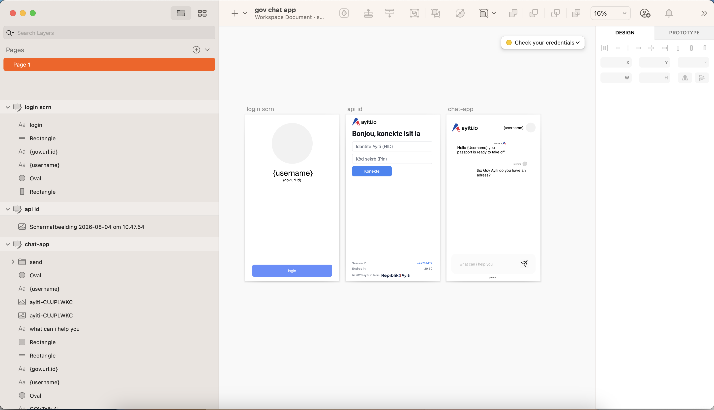
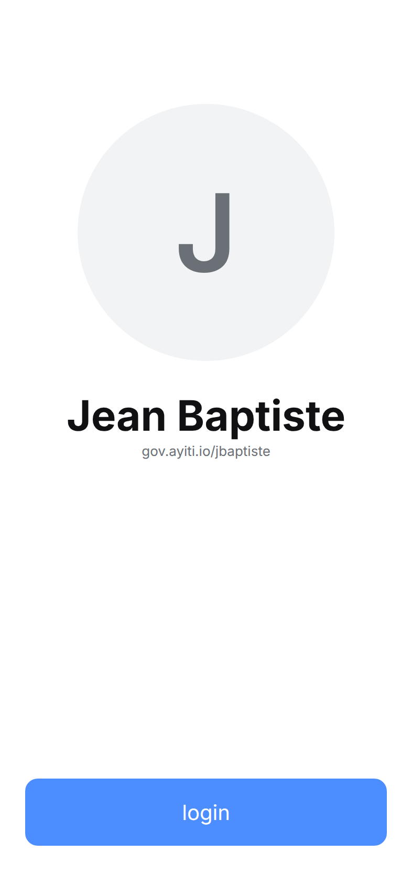
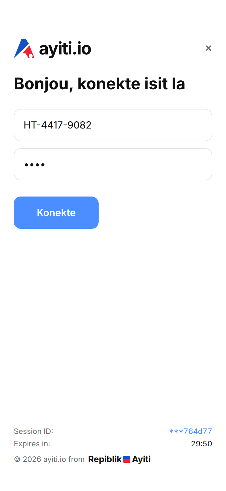
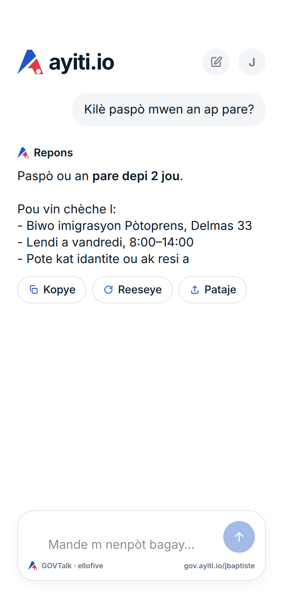
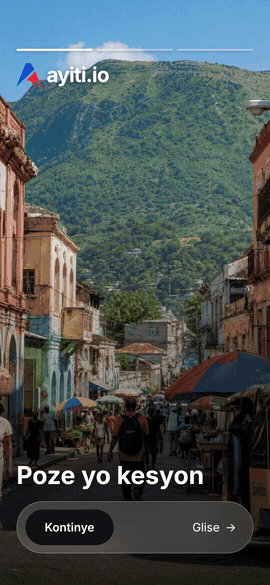

# ayiti.GovApp

**GovApp** is the citizen-facing iOS client for `ayiti.io`, the Republic of
Haiti's government identity platform. A citizen signs in with their Ayiti
Identity (HID) and secret PIN, then talks to **GOVTalk AI**, an assistant backed
by the [ElloFive](https://github.com/EricksonAtHome/ElloFive) LLM runtime.




## Screens

| Welcome | Sign in | GOVTalk AI |
| --- | --- | --- |
|  |  |  |
| Avatar, name, and gov URL ID for a returning citizen, over a full-width login button. | HID and PIN above the live grant countdown and masked session footer. | Conversation with the assistant, composer pinned to the bottom. |

### Walkthrough

Sign in, then ask GOVTalk a question — [full quality (MP4)](docs/walkthrough.mp4).



> **These images are renderings, not captures of a running build.** GovApp has
> never been launched: an iOS app cannot be compiled or run on Linux, which is
> where this repository's automation executes. The frames come from
> [`GovApp/Tools/preview/`](GovApp/Tools/preview/index.html), a browser
> reproduction driven by the same tokens as
> [`Theme.swift`](GovApp/GovApp/DesignSystem/Theme.swift) and the same logo
> geometry as [`AyitiMark.swift`](GovApp/GovApp/DesignSystem/AyitiMark.swift).
> They show what the layout specifies, and they will not catch a SwiftUI
> mistake. Regenerate them with `cd GovApp/Tools/preview && npm install && node capture.mjs`.

The UI is in Haitian Creole (Kreyòl). All copy lives in
[`GovApp/GovApp/L10n.swift`](GovApp/GovApp/L10n.swift).

## Requirements

- Xcode 16 or newer (the project uses synchronized file groups, `objectVersion 77`)
- iOS 17 deployment target
- Node 18+ and [Ollama](https://ollama.com) if you want GOVTalk to answer for real

## Build and test

```bash
open GovApp/GovApp.xcodeproj

# or from the command line
xcodebuild -project GovApp/GovApp.xcodeproj -scheme GovApp \
  -destination 'platform=iOS Simulator,name=iPhone 15' build test
```

The app runs without any backend: every service has a stub, and all SwiftUI
previews are wired to stubs so they never reach the network.

### Without a Mac

The logic layer builds and tests on Linux, which is how it is checked here:

```bash
cd GovApp/Tools/verify && swift test   # 27 tests
```

That package symlinks the real sources and shims the three Apple-only pieces —
see [its README](GovApp/Tools/verify/README.md). It covers `AppConfig`,
`HTTPClient`, `GrantToken`, `Session`, `SessionStore`, both services, the prompt
builder, and both view models. It does **not** cover any SwiftUI view, the
design system, or the Xcode project, so `xcodebuild` on macOS is still the
authoritative check.

## Running GOVTalk locally

```bash
git clone https://github.com/EricksonAtHome/ElloFive.git
cd ElloFive
bash scripts/install.sh      # installs Ollama, pulls llama3.2:3b, builds the models
npm install && npm run api   # FRC bridge on http://127.0.0.1:3000
```

The simulator reaches the host at `127.0.0.1`, and `Info.plist` carries an
`NSAllowsLocalNetworking` exception for that plaintext connection only.

## Configuration

No endpoint, port, model name, or URL scheme is hardcoded in Swift. Everything
is read from [`GovApp/Supporting/Info.plist`](GovApp/Supporting/Info.plist) by
`AppConfig`:

| Key | Default | Purpose |
| --- | --- | --- |
| `GOVAPP_IDENTITY_BASE_URL` | `https://id.ayiti.io` | GovID SSO host |
| `GOVAPP_IDENTITY_MODE` | `direct` | `direct` (native HID/PIN form) or `hosted` (web grant page) |
| `GOVAPP_CALLBACK_SCHEME` | `govapp` | Redirect scheme for the hosted flow |
| `GOVAPP_SESSION_TTL_SECONDS` | `1800` | Grant and session lifetime |
| `GOVAPP_AI_BASE_URL` | `http://127.0.0.1:3000` | ElloFive FRC bridge |
| `GOVAPP_AI_MODEL` | `ellofive` | Model served at `POST /run/{model}` |
| `GOVAPP_AI_CONTEXT_TURNS` | `6` | Prior exchanges replayed to the stateless bridge |

Point `GOVAPP_AI_BASE_URL` at an HTTPS host for anything beyond local
development, and do not widen the ATS exception.

## Layout

```
GovApp/
├── GovApp.xcodeproj/
├── Supporting/Info.plist       Runtime configuration
├── Tools/
│   ├── generate-appicon.py     Renders the app icon from AyitiMark's geometry
│   ├── preview/                Browser rendering behind the README images
│   └── verify/                 Builds and tests the logic layer on Linux
├── GovApp/
│   ├── AppConfig.swift         Endpoints and tunables
│   ├── DesignSystem/           Brand tokens, vector ayiti.io mark, controls
│   ├── Features/               Welcome, Auth, Chat
│   └── Services/               Identity, session, keychain, ElloFive client
└── GovAppTests/
```

## Working on it with Cursor

[`.cursor/skills/govapp-ios/`](.cursor/skills/govapp-ios/SKILL.md) documents the
design tokens, the identity contract, and the GOVTalk integration so an agent
picks up the project's conventions automatically.

## Security notes

- The PIN is never logged, never persisted, and is cleared from memory as soon
  as a sign-in attempt resolves — successful or not.
- The session token lives in the Keychain under
  `kSecAttrAccessibleAfterFirstUnlockThisDeviceOnly`, so it stays off backups.
- `Session` and `Credentials` have redacted `description`s; keep them that way.
- The ElloFive bridge is unauthenticated, so nothing from `Session` and no
  personal data may appear in a prompt.
